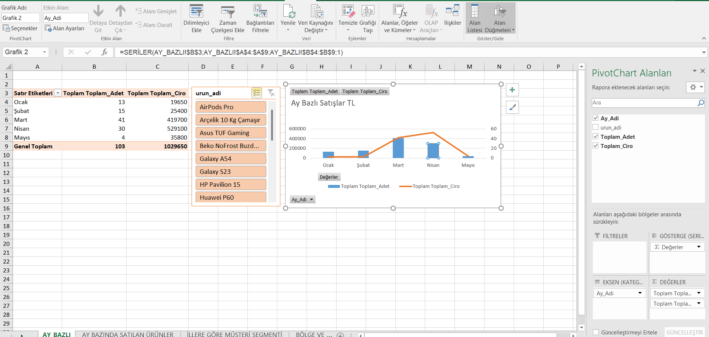
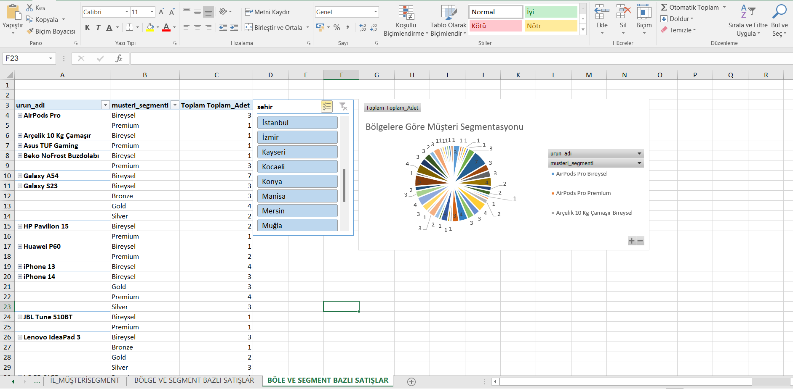
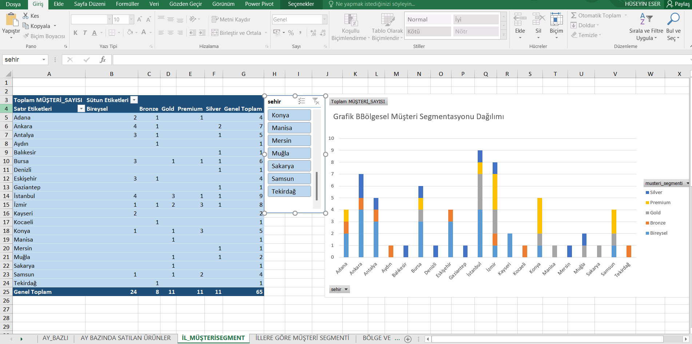

Analiz Yorumu:
Trend Analizi: Veri setindeki satışların Mayıs ve Haziran aylarında yoğunlaştığı gözlemlenmiştir. 
Özellikle Mayıs ayı, hem Ciro (₺) hem de Satış Adedi bazında zirve noktayı oluşturmaktadır.

İş Kararı Notu: Mayıs ayındaki bu yükselişin nedenleri (mevsimsellik veya özel kampanya) baz alınarak,
gelecek yılın aynı dönemi için stok planlaması ve pazarlama bütçesi optimize edilebilir.

Analiz Yorumu:

Bölgesel Yoğunluk: Satışların lokomotif şehirleri İstanbul, İzmir ve Ankara olarak öne çıkmaktadır.
Özellikle İstanbul, hem müşteri sayısı hem de segment çeşitliliği bakımından en yüksek potansiyele sahip pazar konumundadır.

Segment Kırılımı: Toplam veri setinde Bireysel segmenti sayıca en büyük grup (24 kişi) olmasına rağmen; 
Gold, Premium ve Silver segmentlerinin (toplam 33 kişi) birbiriyle dengeli bir dağılım sergilemesi, üst segment müşteri sadakatinin güçlü olduğunu göstermektedir.

Fırsat Alanları: Konya ve benzeri gelişmekte olan bölgelerde Premium ve Gold segment müşterilerin bulunması, 
bu bölgelerin "Yüksek Değerli Müşteri" potansiyelinin yüksek olduğunu ve pazarlama stratejilerinin bu yöne kaydırılabileceğini kanıtlamaktadır.

Analiz Yorumu:

Metropol Odaklı Büyüme: Veriler incelendiğinde, İstanbul (9), İzmir (8) ve Ankara (7) gibi büyükşehirlerin sadece sayıca değil,
segment çeşitliliği bakımından da en zengin iller olduğu saptanmıştır.

Segment Dağılım Stratejisi: Bireysel Segment: Geniş kitlelere yayılmış olup toplamda 24 müşteri ile pazarın tabanını oluşturmaktadır.

Premium & Gold Segment: Bu üst segmentlerin (toplam 22 kişi) büyükşehirlerin dışındaki illerde de (Örn: Konya) görülmesi, 
markanın coğrafi sınırları aşan bir prestij değerine sahip olduğunu göstermektedir.

Kullanılan SQL Sorgularından Bir Parça:
SELECT 
    m.sehir, 
    m.musteri_segmenti, 
    u.urun_adi, 
    SUM(sd.adet) AS Toplam_Adet
FROM musteri m
JOIN siparis s ON m.musteri_id = s.musteri_id 
JOIN siparis_detay sd ON s.siparis_id = sd.siparis_id 
JOIN urun u ON sd.urun_id = u.urun_id
GROUP BY m.sehir, m.musteri_segmenti, u.urun_adi
ORDER BY m.sehir, Toplam_Adet DESC;

Hedefleme Verimliliği: Şehir bazlı yapılan bu kırılım; lojistik, yerel reklam kampanyaları ve stok yönetiminin bölgedeki baskın müşteri segmentine göre 
(Silver, Gold vb.) optimize edilmesine olanak tanımaktadır.

